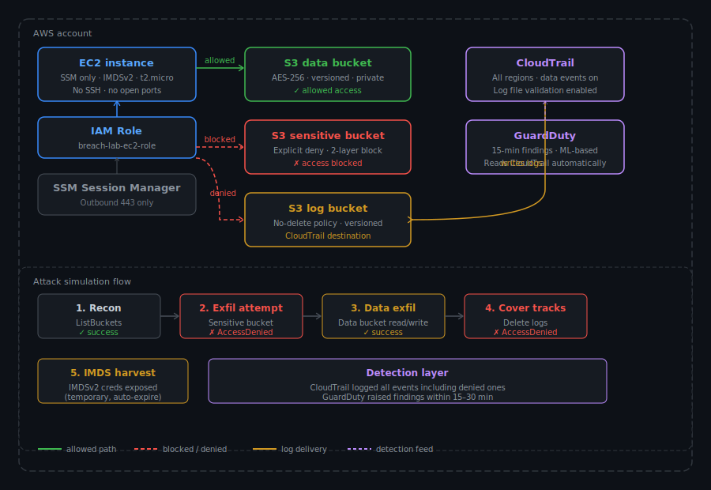

# Cloud Breach Detection & Response Lab

A hands-on AWS security lab that builds a secure baseline, introduces an intentional IAM misconfiguration, simulates an attack, detects it with CloudTrail and GuardDuty, and fixes it with least-privilege IAM and explicit deny policies.

Built entirely with Terraform. Tested step by step.

---

## Architecture



```
EC2 (SSM only · IMDSv2 · no SSH key · no open ports)
  └── IAM Role (breach-lab-ec2-role)

S3 data bucket       → allowed access (AES-256, versioned)
S3 sensitive bucket  → explicit deny (bucket policy + named role deny)
S3 log bucket        → no-delete policy (CloudTrail destination)

CloudTrail           → all regions · S3 data events enabled · log validation on
GuardDuty            → 15-min findings · reads CloudTrail automatically
```

---

## What This Lab Covers

- IAM least privilege and what happens when it's violated
- Explicit deny at the resource level (bucket policy) vs IAM allow
- IMDSv2 enforcement and what it does/doesn't protect against
- CloudTrail data events — why they're off by default and why that matters
- Incident investigation using `lookup-events` and raw log files
- GuardDuty findings — detection lag, what triggers them, their limits
- Defense in depth: layering IAM + bucket policy so one misconfiguration doesn't mean game over

---

## Repo Structure

```
cloud-breach-lab/
├── terraform/
│   ├── versions.tf           # Provider versions
│   ├── variables.tf          # Region variable
│   ├── main.tf               # All infrastructure (secure baseline)
│   ├── outputs.tf            # Bucket names, instance ID, GuardDuty ID
│   └── attack_simulation.tf  # Overpermissive IAM — enable for attack phase
├── docs/
│   ├── incident-report.md    # IR-2024-001
│   ├── writeup.md            # Project write-up
│   └── attack-runbook.md     # Step-by-step attack + investigation commands
└── README.md
```

---

## Prerequisites

- AWS CLI configured with credentials that have permissions to create EC2, IAM, S3, CloudTrail, GuardDuty resources
- Terraform >= 1.3.0
- [SSM Session Manager plugin](https://docs.aws.amazon.com/systems-manager/latest/userguide/session-manager-working-with-install-plugin.html) installed separately from the AWS CLI

---

## Quickstart

```bash
cd terraform

# Initialize
terraform init

# Preview
terraform plan

# Deploy
terraform apply
```

After apply, outputs will show your bucket names and EC2 instance ID. Wait ~2 minutes for the SSM agent to register before connecting.

```bash
# Connect to EC2 (no SSH key needed)
aws ssm start-session --target <ec2-instance-id>
```

---

## Running the Attack Simulation

1. Open `terraform/attack_simulation.tf`
2. Remove the `/*` and `*/` comment block to enable the overpermissive policy
3. Comment out the `aws_iam_policy.ec2_s3_policy` resource in `main.tf`
4. Run `terraform apply`
5. Follow `docs/attack-runbook.md` step by step
6. Wait 15–30 minutes for GuardDuty findings
7. Query CloudTrail to reconstruct the timeline

To fix and validate:
1. Re-enable the least-privilege policy in `main.tf`
2. Comment out `attack_simulation.tf` again
3. Run `terraform apply`
4. Run the validation suite from `docs/attack-runbook.md`

---

## Key Security Concepts

**Explicit deny always wins.**  
An IAM policy that says `s3:*` and a bucket policy that says `Deny s3:*` — the deny wins. This is why the sensitive bucket stayed protected even during the attack.

**CloudTrail data events are off by default.**  
Without enabling `data_resource { type = "AWS::S3::Object" }`, you see IAM and management API calls but not `GetObject`, `PutObject`, or `DeleteObject`. You'd miss the actual data access.

**IMDSv2 doesn't prevent credential theft from inside the instance.**  
It blocks SSRF-based theft (SSRF can't do a `PUT` request). A process or person running on the instance can still pull credentials with two curl commands. Least-privilege IAM is what limits the damage.

**Denied requests are still logged.**  
Every `AccessDenied` response shows up in CloudTrail. The attacker's attempt to delete logs became evidence.

---

## Teardown

```bash
terraform destroy
```

`force_destroy = true` is set on all S3 buckets — this is intentional for lab cleanup. Never use this in production.

---

## What to Improve for Production

- Replace the no-delete bucket policy with **S3 Object Lock (WORM)** — enforced at storage layer, can't be overridden by a policy change
- Add a **CloudWatch alarm** on GuardDuty HIGH severity findings instead of manually checking
- Add **explicit denies** for `cloudtrail:StopLogging` and `guardduty:DeleteDetector` on the EC2 role
- Use a **dedicated VPC** with private subnets and NAT instead of the default VPC
- Enable **SSE-KMS** on the log bucket for per-key-use audit logs
- Complete the credential exfiltration path — export IMDS credentials to a local machine and test them externally
- Add an **SCP (Service Control Policy)** at the AWS Organizations
  level denying `cloudtrail:StopLogging` and `guardduty:DeleteDetector`
  account-wide — enforced above IAM, cannot be overridden by any
  policy including root

---

## Docs

- [Incident Report](docs/incident-report.md)
- [Project Write-Up](docs/writeup.md)
- [Attack Runbook](docs/attack-runbook.md)
